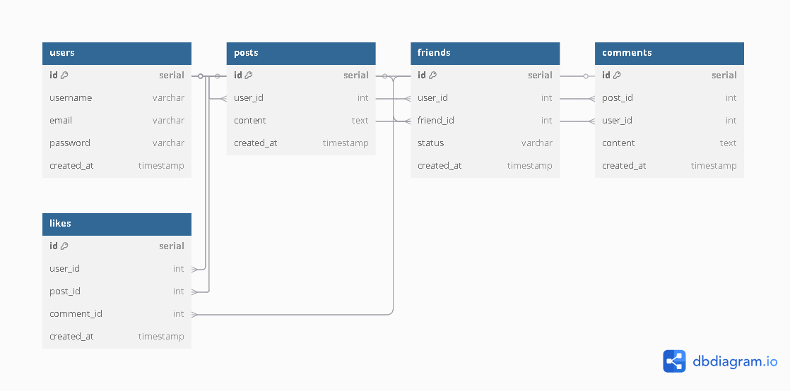

# 📌 Banco de Dados para Rede Social

Este repositório contém a estrutura do banco de dados para uma rede social, incluindo o diagrama ER e os scripts SQL necessários.

## 📁 Estrutura do Repositório

```
├── docs/                 # Documentação e diagramas
│   ├── diagrama.png      # Diagrama ER da rede social
├── sql/                  # Scripts SQL
│   ├── social_network.sql # Script de criação do banco de dados
├── README.md             # Documentação do projeto
```



## 📌 Descrição do Projeto
O objetivo deste projeto é criar um banco de dados para uma rede social, contendo as principais entidades e relacionamentos, como:
- Usuários
- Postagens
- Amizades
- Comentários
- Curtidas

## 🚀 Como Usar
1. Clone este repositório:
   ```bash
   git clone https://github.com/queziasouzaa/social-network-db.git
   cd social-network-db
   ```
2. Execute o script SQL para criar as tabelas no PostgreSQL:
   ```bash
   psql -U queziasouzaa -d social_network -f sql/social_network.sql
   ```

## 📝 Licença
Este projeto está sob a licença MIT. Sinta-se livre para contribuir!

---
📌 Criado por Quézia Souza

